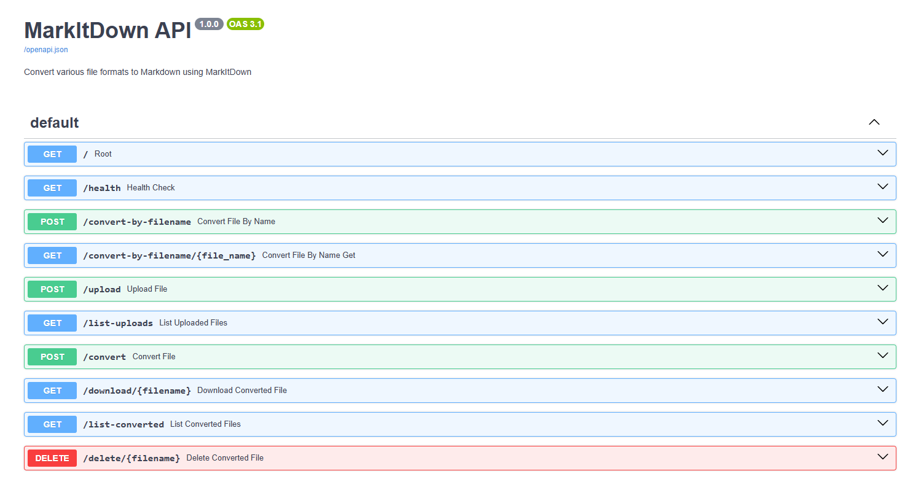

# MarkItDown FastAPI

🚀 A simplified and containerized version of [MarkItDown](https://github.com/microsoft/markitdown) running as a FastAPI service, with a RESTful API for file-to-Markdown conversion.

## ✨ Features

- Convert files to Markdown via API
- Upload, list, download, and delete files
- Lightweight Dockerized setup using `docker-compose`
- Interactive API documentation via Swagger UI

## 📸 API Preview

Here’s a preview of the available endpoints exposed via Swagger UI:



You can access the interactive docs at:
http://localhost:5000/docs
> Make sure the app is running using Docker or FastAPI directly.

## 📦 Getting Started
```bash
git clone https://github.com/Elkhn/markitdown-fastapi.git
cd markitdown-fastapi
docker-compose up --build
```

## Credits & Inspiration

This project is heavily inspired by [MarkItDown](https://github.com/microsoft/markitdown) developed by Microsoft.
This is **not a fork** but a lightweight custom version built for my own needs, removing parts that were not essential for deployment or containerization.
Respect and thanks to the original developers for their excellent work!